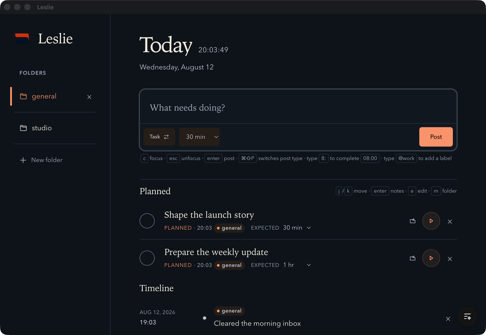

# Leslie

  

<strong>The to-do list you’ll actually keep.</strong>

  Because when plans change, Leslie keeps what you did visible and brings you back to today—not a backlog review.

  <a href="https://leslie.ta-0.com/">Download the macOS beta</a>
  ·
  <a href="https://github.com/thoriqakbar0/leslie/releases/tag/v0.2.1">Read the v0.2.1 release notes</a>

## Why Leslie

A task list remembers what you planned. Your day also contains work you did not plan, partial progress,
and plans that stopped fitting.

Leslie keeps the plan beside a factual work log. You can see what happened, keep its notes and history, and
return to today without turning every unfinished intention into pressure. There are no streaks, scores,
or red overdue counts.

## What Leslie keeps together

- Capture planned work or something you already did from one composer.
- Add expected time to a plan without treating the estimate as a promise.
- Keep unplanned and partial work in a factual timeline.
- Organize work with folders, notes, labels, and activity history.
- Review your day, week, or month without reconstructing it from memory.
- Use keyboard controls for capture, navigation, and editing.

Leslie stores its data in a local SQLite database. It has no account, cloud sync, or automatic updates.

## Download the macOS beta

[Download Leslie v0.2.1 for macOS](https://github.com/thoriqakbar0/leslie/releases/download/v0.2.1/Leslie-v0.2.1-macOS.zip).

This prerelease is ad-hoc signed and not notarized:

1. Download and unzip `Leslie-v0.2.1-macOS.zip`.
2. Move `Leslie.app` into your Applications folder.
3. Right-click Leslie and choose **Open** on the first launch if macOS asks.

## Build Leslie

Leslie uses Electron, React, TypeScript, Tailwind CSS, Vite+, Nub, and SQLite.

- `nub install --frozen-lockfile` installs dependencies from `nub.lock`.
- `nub run dev` starts Vite and the Electron window.
- `nub run check` checks formatting, lint rules, and types.
- `nub run test` runs the test suite once.
- `nub run build` builds the React renderer.
- `nub run start` opens the built Electron application.

Nub 0.7.5 and Node 24.19.0 are pinned in the repository. Vite+ remains the renderer, test,
formatting, and lint engine behind the package scripts.

## Repository map

- `src/` contains the production React application.
- `electron/` contains the desktop shell and local SQLite storage.
- `website/` contains the Cloudflare Pages marketing site.
- `prototype/` preserves the earlier web prototype.
